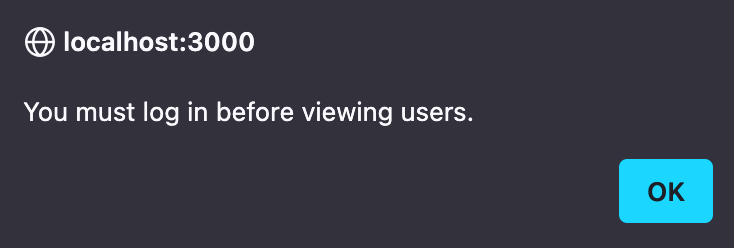

This is a [Next.js](https://nextjs.org) project bootstrapped with [`create-next-app`](https://nextjs.org/docs/app/api-reference/cli/create-next-app).

# Project Documentation

## Project Contributors
👨🏽‍💻 Manuel Notter

## Running the Project

To run the project first clone the repository with `git clone`.
Node.js is required for serverside JavaScript execution.
Node Package Manager was used in the project, it's advised to use npm to run the application.

**Install Node.js on Fedora**
```shell
sudo dnf install nodejs npm
```

**Install Node.js on MacOS**
```shell
brew install node
```

**Verify the installation**
```shell
node -v
```
```shell
npm -v
```

**Install the necessary dependencies with:**
```shell
npm install
```

**Start the project with:**
```shell
npm run dev
```

The App is a single page application accessible on `http://localhost:3000`.

## Summary

The goal was to create a client according to the project specification for project option 2 provided. 

```text
Project option 2: Implement a client

Create a client application using of the following technologies: 
Java (JavaFX), Android (Jetpack Compose), or browser-based (React).
It must be possible to enter the server address and port.
You can use javaprojects.ch:50001 as the default, but it must be 
possible to change this! Send a “ping” to confirm that the address is 
correct. The client must support all API functions of the server listed 
in this document, except for the “debug functionalities”.
Chats with different users must be separated – don’t mix them together!
```

## General Remarks
The project is a React App created with NextJS, using Tailwind for styling the application.
I have experimented using TypeScript in this project, because i want to get to know the language better and I am also using TypeScript in another project at the moment.
I really like the approach of using React components in a frontend project, and I plan to transfer my React skill to React Native in the future.

I am still a beginner in frontend development, so I have used Copilot in this project to help me with autocompletion and problem solving for various functionalities, explaining different syntax that was new to me as well as for helping me to debug my code.

For styling, TailwindCSS has been used, of which I really like the approach.
Even though, in Tailwind different heroicons are available, i have used svg files from Googles Meterial Design Icons as well as one Icon from W3.

For linting JSX and TSX as well as HTML and TypeScript, i have setup ESLint, which I am also learning to configure at the moment. When I started the project, I first also setup Prettier, but it has been to much work to configure and the configuration was not working as expected.
I will take a closer look at Prettier in the future, for the moment I have just used the built in functionalities of VSCodium for autoformatting.

Overall it was a great project, I had a lot of fun and learnt a lot from it!

## Application Structure
The project is a single page application with two main files, the `layout.tsx` and `page.tsx`.

In `layout.tsx` i only have added the base layout with the title and the background. I first wanted to add the sidebar to the layout so I could have the sidebar and the main page as two seperate children in the layout. But I have encountered some problems with Prop-Drilling, which was a new concept to me and therefore I added both of the components as children of the main page.

There are different components that are rendered on the main page.
- Chat
- Login
- Register
- ServerAddress
- Sidebar
- UserList

I also have a service folder with `api.tsx` as the only service inside of it.
All the API calls are handled in this file and imported to where they are needed.

## Functionality
The Application consists of the main window, as well as the sidebar. In the sidebar, different buttons are available to provide all the functionality of the application.

<div style="text-align: center;">
    
</div>

When starting the client, the user can view, set and ping the current server address by clicking on the `Server` button.

<div style="text-align: center;">
    
</div>

After login, the current token can be verified by clicking on the `Token` button.

<div style="text-align: center;">
    
</div>

Using `Login` and `Register`, users can create an account and login to their account. When users are logged in, they can check their current account by clicking on the `Login` button again. Registering an account requires users to logout again.

<div style="text-align: center;">
    
</div>
<br>
<div style="text-align: center;">
    
</div>

To see users, or to chat with a user, users must be logged in.

<div style="text-align: center;">
    
</div>

When logged in, users can view the accounts registered on the server by clicking on the `User` button. This is only a debug functionality, but I have impmenented it for selecting a user to chat with. As stated, in a real-world application this would not be good practice. But in chat applications, there almost always is a list of friends for example. So this functionality could be seen as a 'Friends List' for this project.

<div style="text-align: center;">
    
</div>

When clicking on a user, and then on `Chat`, the chat window opens.
For debugging, one can also chat with himself to see if messages are received.

<div style="text-align: center;">
    
</div>

**EDIT:**
The API endpoint `/users` from the server `http://javaprojects.ch:5001` seems to have been disabled. The endpoint `/users/online` is still working at this time. I have adjusted to select the users from the returned list of online users, which makes more sense anyway. Additionally, to prevent the application not working if this endpoint will get disabled as well, I have implemented a text input field, to choose the username manually. I think this is not a great solution and i like the list better, but now the app will work in any case. It's to be noted, that when entering a username that does not exist, the user will just show as offline.

Code snippet from the user input field:
```ts
<input
type="text"
placeholder="Username"
value={undefined}
onChange={(e) => setSelectedUser(e.target.value)}
className="mb-2 p-2 border rounded text-dark"
required
/>
```

When the chat window is opened, the online status of the current user is indicated to the on top of the chat. Messages in the chat are only stored as long as the window is opened. The server deletes all the messages from the chats, and in the current implementation of this app, the messages are also not persisted by the client.

When clicking `Logout` the current user is logged out, the token and the username are deleted from local storage on the client side, and also from the server.

<div style="text-align: center;">
    
</div>